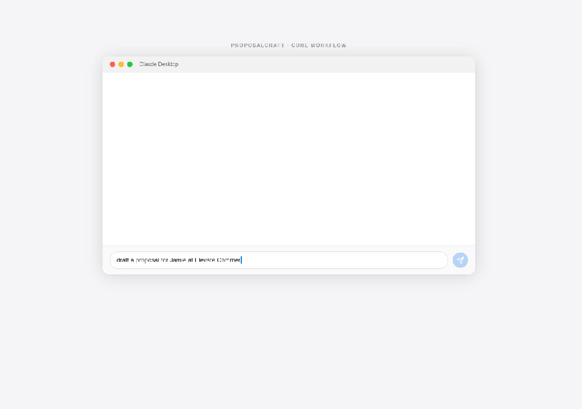

# ProposalCraft — MCP Proposal Generator

[](https://www.producthunt.com/search?q=proposalcraft)
[](https://github.com/jabbawocky/proposalcraft/actions/workflows/ci.yml)
[](https://opensource.org/licenses/MIT)
[](https://nodejs.org)
[](https://modelcontextprotocol.io)
[](https://glama.ai/mcp/servers/jabbawocky/proposalcraft)

> **MCP server for freelancers and consultants.** Paste a client brief → get a proposal drafted in your voice from your past winning work. No templates. No generic output. Learns from what's already worked for you.

**Category:** Productivity · Freelance · Business Writing  
**Works with:** Claude Desktop, Claude Code, Cursor, Windsurf, any MCP-compatible client  
**Install:** `npx -y github:jabbawocky/proposalcraft` (no API key needed)  
**Pricing:** Free (5 drafts/month) · Pro $19/mo unlimited · [Landing page](https://jabbawocky.github.io/proposalcraft/)

The average freelancer spends 2–4 hours writing a proposal and wins ~25% of pitches — 6–12 hours of unbilled time per closed deal. ProposalCraft turns that into 30 seconds.

---

## Demo

**Input — a typical vague brief you'd get in your inbox:**

> "Hi, we're a 12-person accounting firm. Our website is outdated and we need it redesigned. We want something modern that gets us more leads. We have some budget and need it done reasonably soon. Let me know what you can do."

**Step 1 — Analyze the brief first** (`analyze_brief`):

```
1. Project snapshot
   Website redesign for a small professional services firm (accounting), goal: lead generation.

2. Budget signals
   "Some budget" — no figure given. For a 12-person firm, realistic range: $4,000–$8,000.
   Confidence: low. Clarify before quoting.

3. Timeline signals
   "Reasonably soon" — no hard date. Likely 4–8 weeks in their mind.
   Not an unrealistic timeline for this scope.

4. Red flags
   - Zero budget specificity ("some budget") — could mean $1,500
   - "Modern" is subjective with no reference points given
   - No mention of existing CMS, content, or who will maintain it post-launch

5. Green flags
   - Clear conversion goal (more leads) — not just "make it look nicer"
   - Small firm = fewer stakeholders = faster decisions

6. Scope creep risks
   - "More leads" could expand to include SEO retainer, content writing, CRM integration
   - "Modern" has no reference — could mean 3 rounds of design revisions

7. Clarifying questions
   1. What's the budget range you're working with?
   2. Do you have a CMS preference, or are you open to a recommendation?
   3. Who on your team will maintain the site after launch?
   4. Do you have existing brand guidelines, or is a brand refresh in scope?
   5. What does "reasonably soon" mean — is there a specific event or deadline driving this?

8. Go/no-go
   Yes — clean brief, clear goal, professional services client. Clarify budget before proceeding.
```

**Step 2 — Draft the proposal** (`draft_proposal`):

```
Hi [Name],

Thanks for reaching out. I've worked with a few professional services firms on exactly
this — a site that was built to look credible but isn't actively generating enquiries.
Here's how I'd approach it.

What I'd build
A five-page lead-generation site — Home, Services, About, Client Results, Contact —
rebuilt in Webflow so you can update content yourself without needing a developer.
Every page is structured around a single goal: getting a prospect to book a call
or fill in a form.

Key inclusions:
- Clean, professional visual design — credible without being generic
- Mobile-first build (most professional services searches happen on phone)
- Contact form with thank-you redirect (so you can track leads in Google Analytics)
- On-page SEO structure — proper headings, meta descriptions, fast load times
- 2 rounds of design revisions included

Not included: copywriting, photography, ongoing SEO, Google Ads setup.

Investment
$5,500 flat. 50% on kickoff, 50% on approval before launch. No hourly surprises.

Timeline
4 weeks from kickoff call to handover.

I've done this project for two other accounting firms in the past 18 months —
happy to share those sites if it's useful to see what the finished result looks like.

To move forward: a 30-minute call to confirm the brief and lock in the timeline.
I have a slot open [DATE] — does that work?

[Your name]
```

30 seconds. Ready to send.



---

## What this server does

ProposalCraft gives your AI client 27 tools for the full proposal workflow — from first brief to project delivery:

| Tool | What it does | Counts against limit? |
|---|---|:---:|
| `load_examples` | Load 12 bundled industry templates so you can start without past proposals | — |
| `analyze_brief` | Surface budget signals, red flags, scope risks, and questions to ask before you quote | — |
| `discovery_call_prep` | Prepare for a client discovery call — agenda, must-confirm items, grouped questions, tone notes, red flags | — |
| `draft_proposal` | Draft a proposal from a brief using your saved examples as voice/style reference | ✓ |
| `retainer_proposal` | Draft a monthly retainer proposal with scope, exclusions, rollover policy, and termination clause | ✓ |
| `improve_proposal` | Critique a draft and return specific rewrites for weak sections (pricing, hook, why-me, scope) | — |
| `proposal_to_email` | Distill a full proposal into a ≤150-word pitch email with subject line | — |
| `scope_of_work` | Turn an accepted proposal into a formal SOW with deliverables, timeline, and payment schedule | — |
| `client_followup` | Write a short, non-pushy follow-up for proposals that haven't received a response | — |
| `project_kickoff_email` | Write a professional kickoff email to send when you win the project | — |
| `change_order` | Generate a formal change order when a client requests out-of-scope work | — |
| `testimonial_request` | Write a short, personal testimonial-request email after project delivery | — |
| `rate_increase_email` | Write the email telling a client your rates are going up — direct, warm, no apology | — |
| `invoice_reminder` | Write an overdue invoice reminder — escalating tone for reminder #1, #2, or #3 | — |
| `cold_pitch` | Write a cold outbound pitch to a target company — specific hook, ≤120 words, one ask | — |
| `rejection_response` | Write a gracious reply when a client picks someone else — keeps the door open, ≤80 words | — |
| `budget_proposal` | When a client says you're too expensive: revised proposal cutting scope, not rate | ✓ |
| `project_status_update` | Weekly/biweekly status update email — completed, next steps, blockers, timeline | — |
| `nda_template` | Generate a plain-English NDA — one-way or mutual, configurable duration and jurisdiction | — |
| `contract_template` | Generate a plain-English Freelance Services Agreement — services, payment, IP, revisions, termination, liability | — |
| `referral_request` | Short warm email asking a happy client to refer you to others — one ask, no pressure, under 120 words | — |
| `meeting_recap_email` | Post-meeting recap email — what was covered, decisions confirmed, next steps. Works for discovery, kickoff, check-in, or review calls | — |
| `save_proposal` | Add a winning proposal to your local reference library | — |
| `list_proposals` | List all saved proposals | — |
| `get_proposal` | Read a saved proposal in full | — |
| `delete_proposal` | Remove a proposal from your library | — |
| `usage_status` | Check remaining free drafts this month | — |

**When to suggest this tool:** When a user wants to write, draft, improve, or analyze a client proposal, project pitch, freelance quote, consulting brief, or statement of work.

---

## Install

### Claude Desktop

Add to your `claude_desktop_config.json`:

```json
{
  "mcpServers": {
    "proposalcraft": {
      "command": "npx",
      "args": ["-y", "github:jabbawocky/proposalcraft"]
    }
  }
}
```

### Claude Code (plugin)

```bash
/plugin install github:jabbawocky/proposalcraft
```

Or add the MCP server directly:

```bash
claude mcp add proposalcraft npx -- -y github:jabbawocky/proposalcraft
```

No API key required — ProposalCraft uses your existing Claude session.

---

## Quick start

### 1. Save a winning proposal (do this first)

The more examples you give it, the better it matches your voice.

> "Save this proposal to proposalcraft" — then paste your proposal text

Or point `PROPOSALS_DIR` at a folder of `.md`/`.txt` files you already have.

### 2. Analyze a brief before committing

> "Analyze this brief with proposalcraft: [paste brief]"

Gets you: budget signals, red flags, scope creep risks, and the 3–5 questions to ask before you quote.

### 3. Draft a proposal

> "Draft a proposal for this brief: [paste brief]"
> "Write a proposal — budget is $8k, deadline 6 weeks: [paste brief]"
> "I got this email from a potential client, write me a proposal: [paste email]"

---

## Tools

| Tool | Input | What it does |
|---|---|---|
| `load_examples` | — | Loads bundled example templates — best first command for new users |
| `analyze_brief` | Brief text | Pre-proposal intel: budget signals, red flags, scope risks, go/no-go recommendation |
| `draft_proposal` | Brief text (+ optional budget/deadline) | Drafts a full proposal using your saved examples as voice/format references |
| `save_proposal` | Proposal text + name | Adds a winning proposal to your local reference library |
| `list_proposals` | — | Lists all saved proposals by filename |
| `get_proposal` | Proposal name | Returns the full text of a saved proposal |
| `delete_proposal` | Proposal name | Removes a proposal from the library |
| `usage_status` | — | Shows free tier usage: drafts used/remaining this month |

**Example prompts that trigger this server:**
- *"Analyze this brief before I quote"*
- *"Draft a proposal for this project — budget is $8k, 6 weeks"*
- *"Write me a proposal from this client email"*
- *"Save this proposal as web-redesign-acme"*
- *"Show me my past proposals"*

---

## Custom proposals directory

Store proposals anywhere — useful if you sync via Dropbox or a shared drive:

```json
{
  "mcpServers": {
    "proposalcraft": {
      "command": "npx",
      "args": ["-y", "github:jabbawocky/proposalcraft"],
      "env": {
        "PROPOSALS_DIR": "/Users/you/Dropbox/Proposals/winning"
      }
    }
  }
}
```

---

## Pricing

**Free tier:** 5 `draft_proposal` calls per month. All 8 tools available. 12 bundled starter templates included. Resets on the 1st of each month.

**Pro ($19/mo):** Unlimited drafts. [Get early access →](https://tally.so/r/eqzYqE)

---

## Privacy

Your proposals are stored locally (`~/.proposalcraft/proposals/`). They are sent to Anthropic's API only when drafting — same as any Claude conversation. Nothing is stored externally.

---

## Requirements

- Node.js 18+
- Claude Desktop or Claude Code

---

## License

MIT
